# RoyalWheels - Cloud-Native Vehicle Rental Platform 🚗🏍️

<p align="center">
  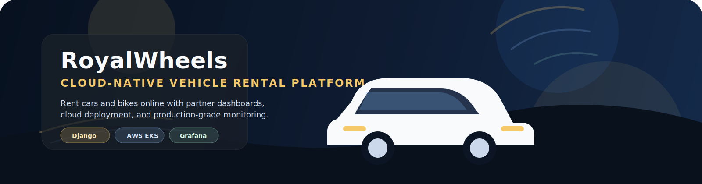
</p>

<p align="center">
  
  
  
  
</p>

<p align="center">
  
  
  
  
  
</p>

<p align="center">
  
  
  
  
</p>

<p align="center">
  <b>A production-style, cloud-native vehicle rental platform for customers, rental partners, and administrators.</b><br/>
  Built with Django, containerized with Docker, deployed on Kubernetes, provisioned with Terraform, and monitored with Prometheus and Grafana.
</p>

---

## Table of Contents

- [Project Overview](#project-overview)
- [Key Features](#key-features)
- [Technology Stack](#technology-stack)
- [System Architecture](#system-architecture)
- [Database Design](#database-design)
- [Application Workflow](#application-workflow)
- [Authentication Workflow](#authentication-workflow)
- [Complete DevOps Workflow](#complete-devops-workflow)
- [Docker Section](#docker-section)
- [Docker Compose Section](#docker-compose-section)
- [Jenkins CI/CD Section](#jenkins-cicd-section)
- [Kubernetes Section](#kubernetes-section)
- [AWS Infrastructure](#aws-infrastructure)
- [Terraform Infrastructure as Code](#terraform-infrastructure-as-code)
- [Monitoring Architecture](#monitoring-architecture)
- [Project Structure](#project-structure)
- [API Endpoints](#api-endpoints)
- [Installation Guide](#installation-guide)
- [Docker Setup](#docker-setup)
- [Kubernetes Deployment](#kubernetes-deployment)
- [Jenkins Setup](#jenkins-setup)
- [AWS Deployment Guide](#aws-deployment-guide)
- [Monitoring Setup](#monitoring-setup)
- [Security Features](#security-features)
- [Challenges Faced](#challenges-faced)
- [Lessons Learned](#lessons-learned)
- [Future Enhancements](#future-enhancements)
- [Screenshots](#screenshots)
- [Contributors](#contributors)
- [License](#license)
- [Acknowledgements](#acknowledgements)

---

## Project Overview

RoyalWheels is a full-stack cloud-native vehicle rental platform that enables customers to rent cars and bikes online while helping rental partners manage vehicles, bookings, expenses, and revenue from a centralized dashboard.

The project is designed to demonstrate modern software engineering practices across:

- Secure authentication and session management
- Django-based backend application development
- REST-style API design
- Containerization with Docker
- CI/CD with Jenkins
- Kubernetes deployment on AWS EKS
- Infrastructure provisioning with Terraform
- Application monitoring with Prometheus and Grafana

This repository is ideal for:

- Portfolio demonstrations
- Internships and placements
- Cloud-native case studies
- DevOps and full-stack project showcases

---

## Key Features

- 🚘 Vehicle management for cars and bikes
- 📅 Booking lifecycle handling
- 🧾 Revenue and expense tracking for rental partners
- 📂 Document upload for license and identity verification
- 🔐 Secure authentication, protected routes, and session management
- 👨‍💼 Admin and partner dashboard
- 💳 Payment flow support
- ☁️ Cloud-ready deployment architecture
- 📈 Real-time monitoring with Prometheus and Grafana

---

## Technology Stack

### Application Stack

| Layer | Technologies | Purpose |
|---|---|---|
| Frontend | HTML, CSS, JavaScript, Django Templates | Responsive UI, pages, and interactive workflows |
| Backend | Python, Django, Django ORM, REST APIs | Business logic, authentication, routing, data handling |
| Database | SQLite, PostgreSQL | Local development and production-grade persistence |
| Authentication | Django Authentication, Session Management, Protected Routes | Secure access control |
| DevOps | Docker, Docker Compose, Jenkins, Kubernetes, Terraform | Build, test, deploy, and infrastructure automation |
| Cloud | AWS EC2, AWS ECR, AWS EKS | Container registry and Kubernetes hosting |
| Monitoring | Prometheus, Grafana | Metrics collection and visualization |

### DevOps and Infrastructure Stack

| Tool | Role |
|---|---|
| Docker | Package the application into a portable container |
| Docker Compose | Run the web app locally with supporting services |
| Jenkins | Automate build, test, image push, and deployment |
| Terraform | Provision AWS infrastructure as code |
| AWS ECR | Store versioned Docker images |
| AWS EKS | Run Kubernetes workloads on AWS |
| Prometheus | Scrape metrics and monitor the application |
| Grafana | Visualize system and app health dashboards |

---

## System Architecture

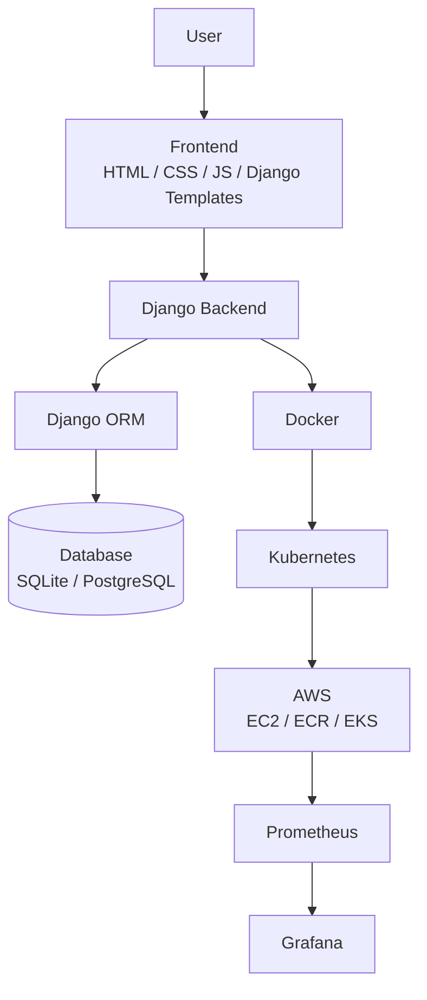

### Architecture Summary

- Users interact through the web UI built with Django templates and frontend assets.
- Django handles business logic, booking flows, dashboards, and API endpoints.
- Django ORM manages communication with the relational database.
- The application is packaged in Docker for portability and consistency.
- Kubernetes runs the containerized workload in a scalable cluster on AWS EKS.
- Prometheus collects metrics from the platform.
- Grafana provides observability dashboards for monitoring and analysis.

---

## Database Design

RoyalWheels uses a relational data model centered around rental partners, vehicles, bookings, and expenses.

### Core Entities

| Model | Purpose |
|---|---|
| `OwnerProfile` | Stores rental partner details, verification status, and revenue metrics |
| `Vehicle` | Stores vehicle inventory for cars and bikes |
| `VehicleImage` | Maintains additional vehicle gallery images |
| `Booking` | Tracks booking requests, document uploads, payment data, and status |
| `Expense` | Records partner-side operating expenses |

### Entity Notes

- `OwnerProfile`
  - Linked one-to-one with a Django user account
  - Tracks business name, address, contact details, and verification state
  - Exposes computed values for revenue, expenses, and profit

- `Vehicle`
  - Linked to an owner profile
  - Supports car and bike categories
  - Stores rent, fuel type, availability, and verification status

- `VehicleImage`
  - Supports multi-image galleries for a single vehicle
  - Useful for richer listings and better customer trust

- `Booking`
  - Captures customer details, document uploads, rental dates, payment details, and lifecycle status
  - Supports rental by day or hour
  - Includes Razorpay fields for payment integration

- `Expense`
  - Stores recurring or ad-hoc operational expenses
  - Helps partners track profitability in the dashboard

### ER Diagram

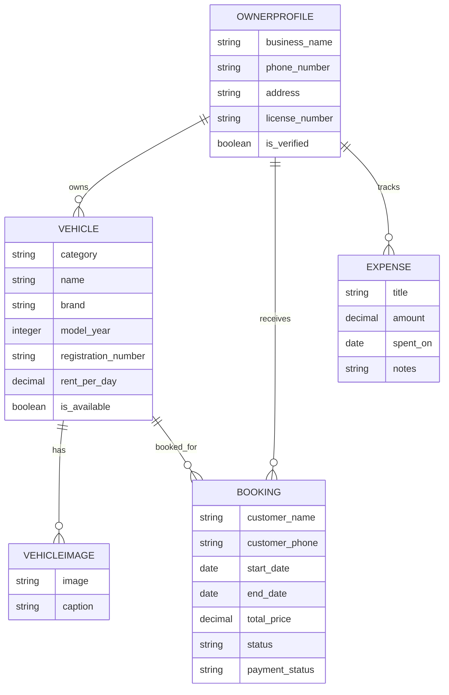

---

## Application Workflow

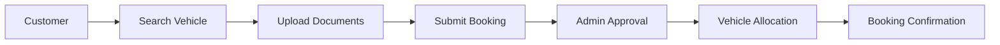

### Workflow Explanation

1. The customer searches for an available car or bike.
2. Required documents are uploaded for validation.
3. Booking details are submitted to the system.
4. The admin or partner reviews and approves the request.
5. The vehicle is allocated and marked accordingly.
6. The booking is confirmed and ready for fulfillment.

---

## Authentication Workflow

```mermaid
flowchart TD
    A[authenticate()] --> L[login()]
    L --> R[login_required protected routes]
    R --> O[Authorized dashboard / booking actions]
    O --> X[logout()]
```

### Authentication Notes

- `authenticate()` validates credentials.
- `login()` creates a secure authenticated session.
- `login_required` protects sensitive pages and APIs.
- `logout()` terminates the session cleanly.

---

## Complete DevOps Workflow

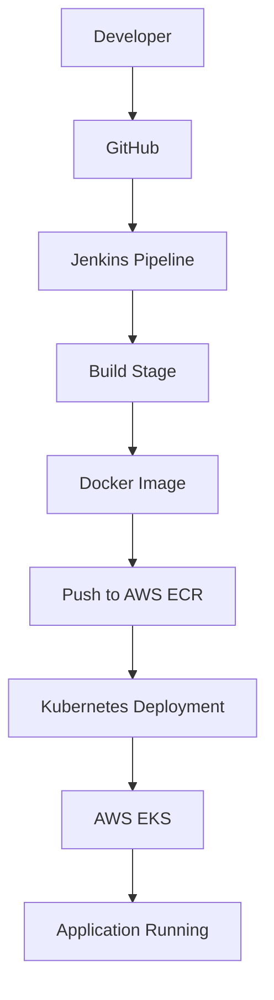

### Pipeline Stages

| Stage | Description |
|---|---|
| Developer | Code changes are committed and pushed to GitHub |
| GitHub | Serves as the source repository and trigger point |
| Jenkins Pipeline | Automates build, test, image packaging, and deployment |
| Build Stage | Installs dependencies and runs checks/tests |
| Docker Image | Packages the Django app consistently for runtime |
| Push to AWS ECR | Publishes versioned images to a private registry |
| Kubernetes Deployment | Applies manifests or Kustomize overlays |
| AWS EKS | Runs the workload on a managed Kubernetes cluster |
| Application Running | The platform becomes available to end users |

---

## Docker Section

Docker is used to make the application environment consistent across development, testing, and deployment.

### Why Docker Is Used

- Eliminates environment drift
- Packages the Django app with its runtime dependencies
- Makes local and cloud deployment reproducible
- Simplifies CI/CD image creation

### Dockerfile Workflow

1. Start from a lightweight Python base image
2. Set runtime environment variables
3. Install Python dependencies
4. Copy the application source
5. Run `collectstatic`
6. Launch Gunicorn on port `8000`

### Containerization Benefits

- Portable between local machines and cloud clusters
- Versioned application releases
- Easier scaling on Kubernetes
- Cleaner deployment rollback strategy

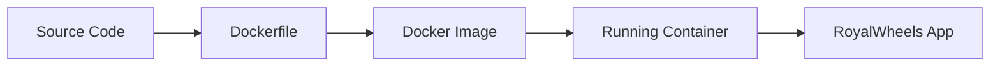

---

## Docker Compose Section

Docker Compose is used to run the application locally in a simple multi-container style.

### Why Docker Compose Is Used

- Rapid local setup
- Consistent development workflow
- Simplified container orchestration
- Easy volume and port management

### Service Orchestration

The current `docker-compose.yml` runs the web application service with persistent static and media volumes.

### Multi-Container Architecture

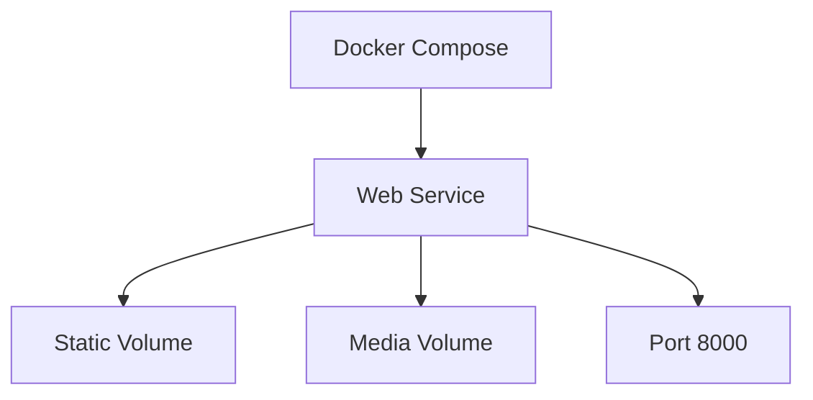

---

## Jenkins CI/CD Section

Jenkins automates the delivery pipeline from code checkout to deployment.

### Pipeline Stages

- Checkout
- Install dependencies
- Run tests
- Build Docker image
- Push image to AWS ECR
- Deploy to Kubernetes

### Jenkins Pipeline Diagram

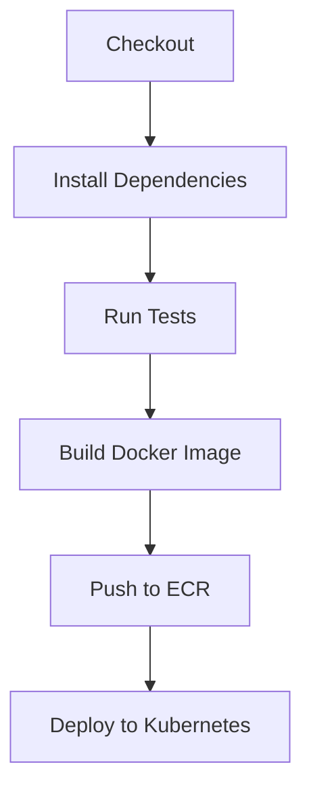

### What Each Stage Does

| Stage | Purpose |
|---|---|
| Checkout | Pulls the latest code from GitHub |
| Install Dependencies | Installs Python packages required by the backend |
| Run Tests | Executes Django tests to validate app behavior |
| Build Docker Image | Creates a deployable container artifact |
| Push to ECR | Stores the image in AWS ECR for deployment |
| Deploy to Kubernetes | Updates workloads in the EKS cluster |

---

## Kubernetes Section

Kubernetes is the runtime platform for the containerized RoyalWheels application.

### Core Concepts Used

- **Pods**: Host the application container
- **Deployments**: Manage rollout and replica state
- **Services**: Expose the application inside or outside the cluster
- **Ingress**: Can be used for HTTP routing in production setups
- **HPA**: Supports horizontal scaling based on load

### Kubernetes Architecture

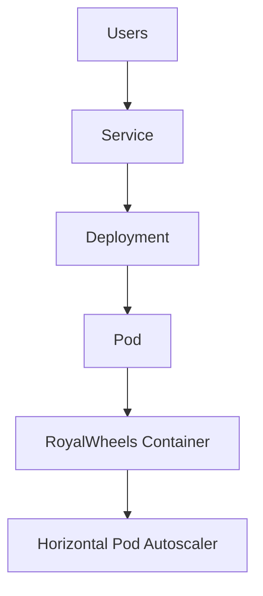

### Manifests in This Repository

- `k8s/base/namespace.yaml`
- `k8s/base/configmap.yaml`
- `k8s/base/secret.example.yaml`
- `k8s/base/deployment.yaml`
- `k8s/base/service.yaml`
- `k8s/monitoring/prometheus.yaml`
- `k8s/monitoring/grafana.yaml`

---

## AWS Infrastructure

RoyalWheels is designed to run on AWS with a clear separation of responsibilities.

### AWS Components

| Service | Role |
|---|---|
| EC2 | Worker nodes for Kubernetes workloads |
| ECR | Private container registry |
| EKS | Managed Kubernetes control plane |
| VPC | Network isolation and segmentation |
| Security Groups | Instance and database traffic control |

### AWS Deployment Architecture

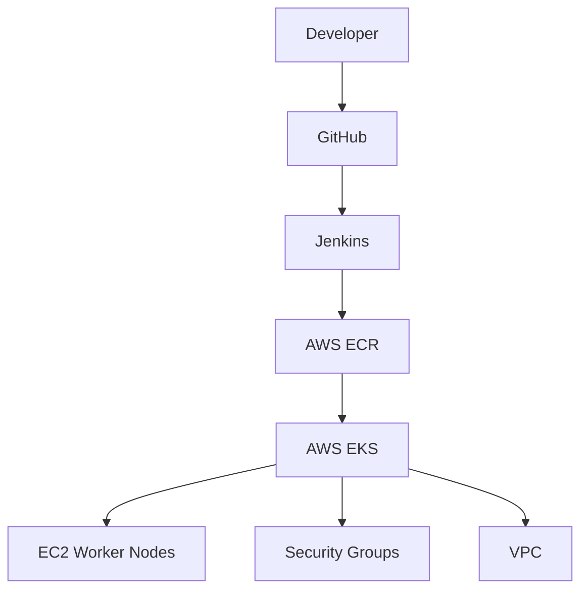

### Infrastructure Notes

- The Terraform configuration provisions the VPC, public subnets, security groups, ECR, EKS, and a PostgreSQL database.
- The application image is stored in ECR and pulled by the Kubernetes deployment.
- Security groups restrict access to the database and cluster components.

---

## Terraform Infrastructure as Code

Terraform manages infrastructure using declarative configuration files.

### What Terraform Does Here

- Provisions AWS ECR for container images
- Creates the VPC and internet gateway
- Sets up public subnets and route tables
- Configures security groups
- Provisions an EKS cluster and node group
- Creates a PostgreSQL database instance

### Benefits

- Reproducible infrastructure
- Easy review and version control
- Faster environment provisioning
- Safer infrastructure changes

### Terraform Workflow

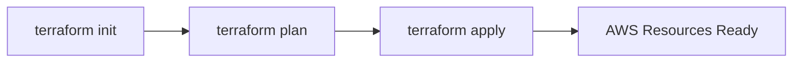

---

## Monitoring Architecture

Prometheus and Grafana provide observability for the deployed application.

### Monitoring Stack

- **Prometheus** collects metrics from the RoyalWheels service.
- **Grafana** visualizes the collected metrics in dashboards.
- The app exposes health and metrics endpoints for visibility.

### Monitoring Architecture Flow

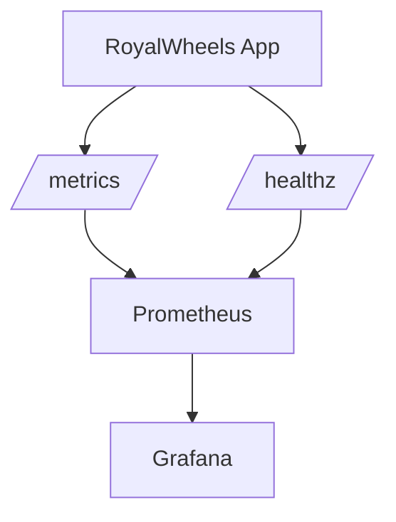

### Observability Highlights

- `/healthz/` endpoint for liveness and readiness checks
- `django_prometheus` integration for metrics exposure
- Prometheus scrape configuration in Kubernetes
- Grafana dashboard provisioning in the monitoring manifests

---

## Project Structure

```text
RoyalWheels/
├── backend/
│   ├── backend/
│   │   ├── settings.py
│   │   ├── urls.py
│   │   ├── asgi.py
│   │   └── wsgi.py
│   ├── app/
│   │   ├── models.py
│   │   ├── views.py
│   │   ├── urls.py
│   │   ├── forms.py
│   │   ├── admin.py
│   │   ├── migrations/
│   │   ├── management/
│   │   ├── templates/
│   │   └── static/
│   ├── media/
│   ├── staticfiles/
│   ├── requirements.txt
│   └── manage.py
├── k8s/
│   ├── base/
│   │   ├── namespace.yaml
│   │   ├── configmap.yaml
│   │   ├── secret.example.yaml
│   │   ├── deployment.yaml
│   │   ├── service.yaml
│   │   └── kustomization.yaml
│   └── monitoring/
│       ├── prometheus.yaml
│       ├── grafana.yaml
│       ├── grafana-dashboards-configmap.yaml
│       ├── grafana-provisioning-*.yaml
│       └── kustomization.yaml
├── terraform/
│   ├── main.tf
│   ├── variables.tf
│   ├── outputs.tf
│   ├── terraform.tfvars
│   └── terraform.tfvars.example
├── Dockerfile
├── docker-compose.yml
├── Jenkinsfile
├── README.md
├── .dockerignore
└── .gitignore
```

---

## API Endpoints

### Vehicle APIs

| Method | Endpoint | Description |
|---|---|---|
| GET | `/api/vehicles/` | Fetch vehicle listings |

### Booking APIs

| Method | Endpoint | Description |
|---|---|---|
| GET | `/api/bookings/` | Fetch booking records |
| POST | `/api/bookings/create/` | Create a new booking |
| POST | `/api/bookings/cancel/` | Cancel an existing booking |

### Expense APIs

| Method | Endpoint | Description |
|---|---|---|
| POST | `/api/expenses/add/` | Add a new expense entry |

### Dashboard APIs

| Method | Endpoint | Description |
|---|---|---|
| GET | `/api/dashboard/` | Return owner dashboard metrics |

### Authentication and Profile APIs

| Method | Endpoint | Description |
|---|---|---|
| POST | `/api/customers/login/` | Customer login |
| POST | `/api/customers/signup/` | Customer registration |
| POST | `/api/customers/reset-password/` | Reset customer password |
| POST | `/api/otp/send/` | Send OTP |
| POST | `/api/otp/verify/` | Verify OTP |
| POST | `/api/profile/update-email/` | Update owner email |
| POST | `/api/customers/profile/upsert/` | Create or update customer profile |

### Payment APIs

| Method | Endpoint | Description |
|---|---|---|
| POST | `/api/payments/razorpay/order/` | Create Razorpay order |
| POST | `/api/payments/razorpay/verify/` | Verify Razorpay payment |

### Feedback API

| Method | Endpoint | Description |
|---|---|---|
| POST | `/api/feedback/submit/` | Submit customer feedback |

---

## Installation Guide

### 1. Clone the Repository

```bash
git clone https://github.com/anam-tabassum64/RoyalWheels.git
cd RoyalWheels
```

### 2. Create a Virtual Environment

```bash
cd backend
python -m venv .venv
```

### 3. Activate the Environment

```bash
# Windows
.venv\Scripts\activate

# macOS/Linux
source .venv/bin/activate
```

### 4. Install Requirements

```bash
pip install --upgrade pip
pip install -r requirements.txt
```

### 5. Apply Migrations

```bash
python manage.py migrate
```

### 6. Run the Development Server

```bash
python manage.py runserver
```

The app will be available at `http://127.0.0.1:8000/`.

<details>
<summary><strong>Environment Variables</strong></summary>

Set the following values in your environment or a `.env` file:

```bash
DJANGO_SECRET_KEY=
DATABASE_URL=
RAZORPAY_KEY_ID=
RAZORPAY_KEY_SECRET=
EMAIL_HOST_USER=
EMAIL_HOST_PASSWORD=
```

</details>

---

## Docker Setup

### Docker Build

```bash
docker build -t royalwheels-web .
```

### Docker Run

```bash
docker run -p 8000:8000 royalwheels-web
```

### Docker Compose

```bash
docker compose up --build
```

### Docker Deployment Flow

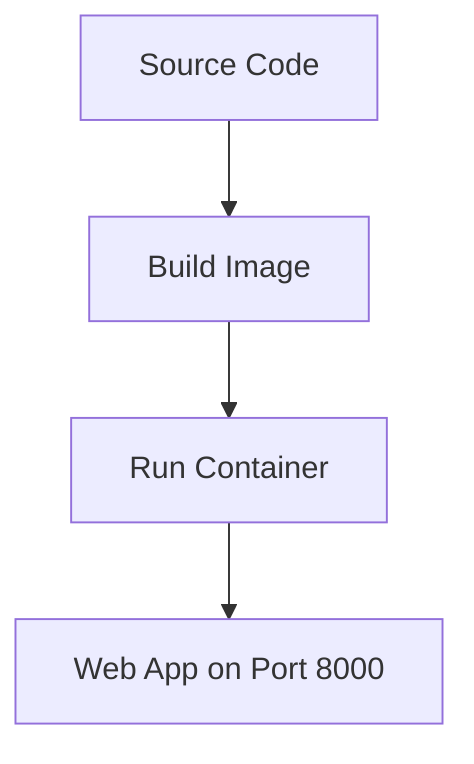

---

## Kubernetes Deployment

### Apply Manifests

```bash
kubectl apply -k k8s/base
kubectl apply -k k8s/monitoring
```

### Inspect Workloads

```bash
kubectl get pods
kubectl get svc
```

### Kubernetes Deployment Notes

- `k8s/base` contains the application namespace, config, deployment, and service.
- `k8s/monitoring` contains Prometheus and Grafana manifests.
- The deployment uses health probes based on `/healthz/`.

---

## Jenkins Setup

For the exact Jenkins credential and AWS IAM setup, see [docs/jenkins-aws-setup.md](C:/Users/Lenovo/Downloads/RoyalWheels/RoyalWheels/docs/jenkins-aws-setup.md).

### Step-by-Step Integration

1. Create a Jenkins pipeline job.
2. Connect the job to the GitHub repository.
3. Configure AWS credentials in Jenkins.
4. Set the AWS region and ECR repository name.
5. Ensure Docker, AWS CLI, and `kubectl` are available on the Jenkins agent.
6. Run the pipeline to:
   - Checkout code
   - Install dependencies
   - Run tests
   - Build image
   - Push to ECR
   - Deploy to EKS

### Jenkins Best Practices

- Store secrets in Jenkins credentials, not in code
- Use immutable image tags
- Run tests before deployment
- Fail fast on build errors

---

## AWS Deployment Guide

### Deployment Steps

1. Provision infrastructure using Terraform.
2. Create or verify the ECR repository.
3. Build and push the Docker image.
4. Update the Kubernetes deployment to use the new image tag.
5. Apply manifests to the EKS cluster.
6. Verify pods, services, and health checks.
7. Open Grafana and Prometheus dashboards for observability.

### Recommended AWS Flow

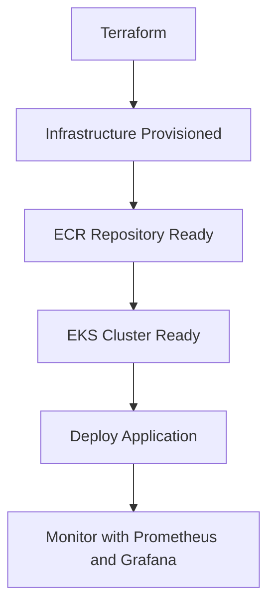

---

## Monitoring Setup

### Prometheus Configuration

- Prometheus scrapes the RoyalWheels application metrics endpoint.
- The scrape interval is defined in `k8s/monitoring/prometheus.yaml`.
- Metrics are exposed through the Django Prometheus integration.

### Grafana Configuration

- Grafana visualizes the collected metrics.
- Dashboard provisioning is managed through Kubernetes manifests.
- The repository includes a prebuilt RoyalWheels overview dashboard.

### Monitoring Benefits

- Faster issue detection
- Better production visibility
- Simple health verification
- Useful signals for demos and interviews

---

## Security Features

- **Authentication**: Django authentication secures user access.
- **Authorization**: Protected routes limit access to sensitive views.
- **Session Management**: Authenticated sessions are managed server-side.
- **File Upload Security**: Document uploads are isolated under controlled media paths.
- **Input Validation**: Forms and views validate incoming user data before processing.

---

## Challenges Faced

- Designing a rental workflow that supports both customer and partner journeys
- Handling document upload and verification flows
- Coordinating backend logic with dashboard metrics
- Preparing the application for cloud-native deployment
- Managing infrastructure, deployment, and observability in one project

---

## Lessons Learned

- A clean domain model makes dashboard logic easier to maintain
- Containerization removes a large class of environment-related issues
- Kubernetes works best when health checks and configuration are explicit
- Terraform makes cloud infrastructure repeatable and reviewable
- Monitoring should be designed alongside application delivery, not after it

---

## Future Enhancements

- Payment gateway expansion
- GPS tracking for live vehicle location
- Mobile app support
- AI-based vehicle recommendations
- Real-time notifications
- Dynamic pricing and surge pricing
- Advanced analytics for partner performance

---

## Screenshots

> Add screenshots here to make the README even stronger for GitHub, portfolio, and placement reviews.

| Screen | Preview |
|---|---|
| Home Page | `` |
| Booking Page | `` |
| Admin Dashboard | `` |
| Vehicle Management | `` |
| Grafana Dashboard | `` |
| Kubernetes Dashboard | `` |

---

## Contributors

- **Anam Tabassum**
- **RoyalWheels Contributors**

If you contributed to the project, feel free to add your name here.

---

## License

This project is intended for educational and portfolio use. Add a license file if you want to publish the project under a specific open-source license.

---

## Acknowledgements

- Django community
- Docker community
- Kubernetes community
- AWS documentation and best practices
- Jenkins ecosystem
- Prometheus and Grafana projects

---

<p align="center">
  <b>RoyalWheels</b> is built to look strong on GitHub, read well in interviews, and communicate a complete cloud-native delivery story from development to observability. 🚀
</p>
